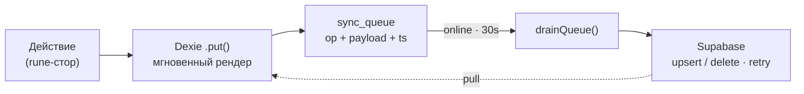
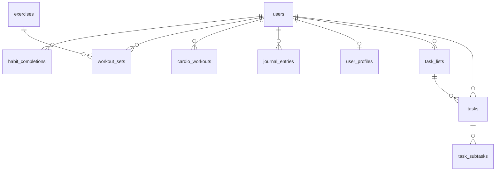
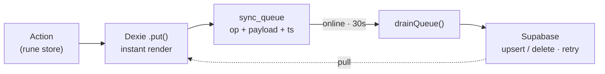

<div align="center">

# Habit Tracker PWA

**Offline-first PWA на SvelteKit 5 + Supabase с оптимистичным local-first движком синхронизации.**

[](https://kit.svelte.dev)
[](https://www.typescriptlang.org)
[](https://tailwindcss.com)
[](https://supabase.com)
[](https://vite.dev)
[](https://web.dev/progressive-web-apps/)


**[Живое демо](https://vaskaalexalex.github.io/habit-tracker/)** · [Русский](#русский) · [English](#english)

</div>

> **Демо:** https://vaskaalexalex.github.io/habit-tracker/ — вход `demo@habit-tracker.app` / `habit-demo-2026` (email + пароль, аккаунт уже наполнен данными).

---

## Русский

### Технологии

| Слой | Стек |
|------|------|
| **UI** | SvelteKit 2, Svelte 5 (runes: `$state` / `$derived` / `$effect`), TypeScript strict |
| **Стили** | Tailwind CSS 4 (`@tailwindcss/vite`), OKLCH-токены, dark/light |
| **Бэкенд** | Supabase — Postgres, Row Level Security, auth по email+паролю |
| **Offline** | Dexie (IndexedDB) + таблица `sync_queue`, optimistic UI, last-write-wins |
| **PWA** | `@vite-pwa/sveltekit`, Workbox SW, install prompt, Web Push (Edge Function) |
| **Утилиты** | layerchart, date-fns, lucide-svelte |
| **Сборка / CI** | Vite 6, pnpm, ESLint, Prettier, GitHub Actions |
| **Хостинг** | GitHub Pages / Cloudflare Pages (`adapter-static`, SPA + `200.html`) |

### Архитектура

Local-first: каждое действие пишется в IndexedDB и рендерится мгновенно, затем в фоне уходит в Supabase. Очередь дренится при `online` и раз в 30с; конфликты — last-write-wins по `updated_at`.



### Схема БД

Все таблицы — per-user, защищены RLS (`auth.uid() = user_id`). DDL: [`supabase/migrations/`](supabase/migrations).



### Возможности

| Раздел | Кратко |
|--------|--------|
| **Привычки** | 4 привычки в один тап, heatmap + месячный график |
| **Спорт** | силовые подходы (вес × повторы) по каталогу + кардио |
| **Дневник** | запись в день, настроение 1–5 |
| **Задачи** | списки, статусы, приоритеты, дедлайны, подзадачи (offline-first) |
| **PWA** | установка на телефон, тёмная/светлая тема, push-напоминания |

### Запуск

```bash
pnpm install
cp .env.example .env   # PUBLIC_SUPABASE_URL + PUBLIC_SUPABASE_ANON_KEY
pnpm dev               # http://localhost:5173
```

Supabase: `supabase db push`, провайдер **Email**, затем один раз [`supabase/seed-demo.sql`](supabase/seed-demo.sql) для демо-данных.

| Команда | Действие |
|---------|----------|
| `pnpm dev` / `build` / `preview` | dev-сервер / SPA-сборка / preview |
| `pnpm check` / `lint` / `format` | типы+a11y / ESLint+Prettier / автоформат |
| `pnpm test:pwa-offline` | прод-сборка + офлайн-перезагрузка с SW |

Деплой: GitHub Actions → GitHub Pages ([`deploy.yml`](.github/workflows/deploy.yml), `BASE_PATH=/habit-tracker`); секреты `PUBLIC_SUPABASE_*`. Аналогично работает на Cloudflare Pages.

---

## English

### Tech stack

| Layer | Stack |
|-------|-------|
| **UI** | SvelteKit 2, Svelte 5 (runes: `$state` / `$derived` / `$effect`), TypeScript strict |
| **Styling** | Tailwind CSS 4 (`@tailwindcss/vite`), OKLCH tokens, dark/light |
| **Backend** | Supabase — Postgres, Row Level Security, email+password auth |
| **Offline** | Dexie (IndexedDB) + `sync_queue` table, optimistic UI, last-write-wins |
| **PWA** | `@vite-pwa/sveltekit`, Workbox SW, install prompt, Web Push (Edge Function) |
| **Utils** | layerchart, date-fns, lucide-svelte |
| **Build / CI** | Vite 6, pnpm, ESLint, Prettier, GitHub Actions |
| **Hosting** | GitHub Pages / Cloudflare Pages (`adapter-static`, SPA + `200.html`) |

### Architecture

Local-first: every action writes to IndexedDB and renders instantly, then syncs to Supabase in the background. The queue drains on `online` and every 30s; conflicts resolve last-write-wins by `updated_at`.



### Database

Per-user tables protected by RLS (`auth.uid() = user_id`). DDL: [`supabase/migrations/`](supabase/migrations).


### Features

| Area | TL;DR |
|------|-------|
| **Habits** | 4 one-tap habits, heatmap + month chart |
| **Sport** | strength sets (weight × reps) from a catalog + cardio |
| **Journal** | one entry per day, 1–5 mood |
| **Tasks** | lists, statuses, priorities, due dates, subtasks (offline-first) |
| **PWA** | installable, dark/light theme, push reminders |

### Run

```bash
pnpm install
cp .env.example .env   # PUBLIC_SUPABASE_URL + PUBLIC_SUPABASE_ANON_KEY
pnpm dev               # http://localhost:5173
```

Supabase: `supabase db push`, enable the **Email** provider, then run [`supabase/seed-demo.sql`](supabase/seed-demo.sql) once for demo data.

| Command | Action |
|---------|--------|
| `pnpm dev` / `build` / `preview` | dev server / SPA build / preview |
| `pnpm check` / `lint` / `format` | types+a11y / ESLint+Prettier / format |
| `pnpm test:pwa-offline` | prod build + offline reload with SW |

Deploy: GitHub Actions → GitHub Pages ([`deploy.yml`](.github/workflows/deploy.yml), `BASE_PATH=/habit-tracker`); secrets `PUBLIC_SUPABASE_*`. Runs on Cloudflare Pages too.
